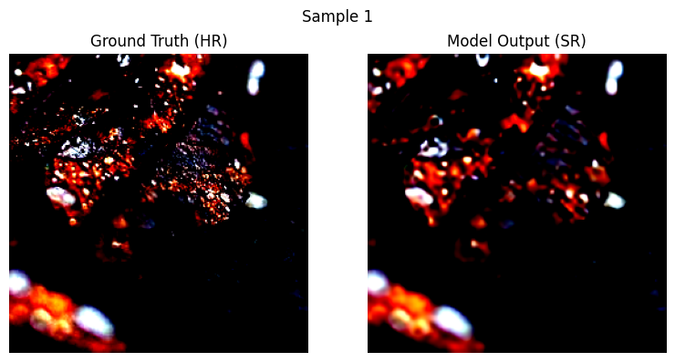
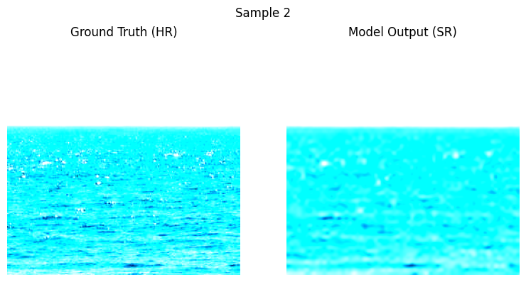

# 4× Super Resolution


## 🔹 프로젝트 구조

```
datasets/
    dataloader.py
    imagedataset.py
models/
    swinir.py
utils/
    data_utils.py
    train.py
    test.py
    evaluate.py
    transforms.py
    visualize.py
main.py
requirements.txt
Dockerfile
```
---
## 🔹 실행법 (for Local PC)

### ☝️ Requirements 설치

```
pip install -r requirements.txt
```

### ✌️ 실행

```
python main.py
```
---
## 🔹 도커 실행법 (for Docker User)

### ☝️ 도커 이미지 빌드

```
docker build -t sr_swinir .
```

### ✌️ 컨테이너 실행

```
docker run --rm --gpus all sr_swinir
```

---

## 🔹 데이터셋

Unsplash  
Unsplash 데이터셋은 약 25,000장의 다양한 클래스를 가진 공개 이미지 데이터셋 입니다. 이 데이터셋은 다양한 클래스의 이미지를 이용한 모델을 작업하는데 적합합니다.
  
데이터셋은 공식 사이트`https://unsplash.com/ko`에서 무료로 다운로드 가능합니다.  
해당 작업물에는 `datasets/unsplash` 폴더에 **샘플 이미지**만 포함되어 있습니다.  

---

## 🔹 결과

50 에포크 학습 후, 결과:

```
Test Dice Score: 72.96%
```

예측 결과 예시:

  
  


---
소개 페이지: 
06unoh